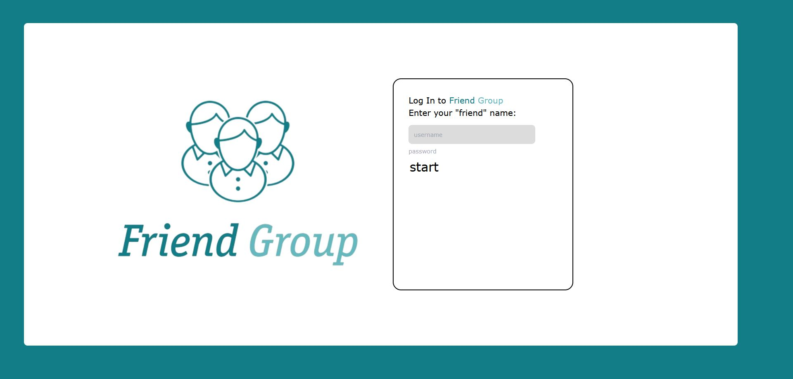

# FriendGroup - Social Media App

**"Stay in touch rather than connect from scratch"**

## Introduction
Welcome to our project where our key focus is on maintaining deep friendships, rather than starting the process of a new friendship from scratch over and over again.

## Usage
Clone the repository and open the index.html in the frontend public folder.

In order to enter the chat you have to create a username. In the chat you can send the messages and your friends in the group can read them.

*Login-Screen:*  

## Features

- **Create Friend Groups:** Create your "FriendGroup" or be added to your friends "FriendGroup".
  
- **Group Chat:** A group chat designed to stay in touch and make plans. Similar to WhatsApp group chat but tailored to the needs of close friend groups.

## In Development (MVP)

- **Node.js Backend:** Utilizes a .json file that acts like a database to store group chat messages.

- **Frontend:** Uses JavaScript, CSS, and HTML to provide a user-friendly interface.

## Future Features

- **Shared Notes:** The ability to share notes with the friend group.

- **Location Map:** A map view to see where your friends are currently located.

## Contributors

This project is developed by an agile team of 6 software developers and designers using the Scrum methodology.

## Get Involved

If you're interested in our project or want to contribute to the team, contact us at s.mayer@HTBLALeonding.onmicrosoft.com.
